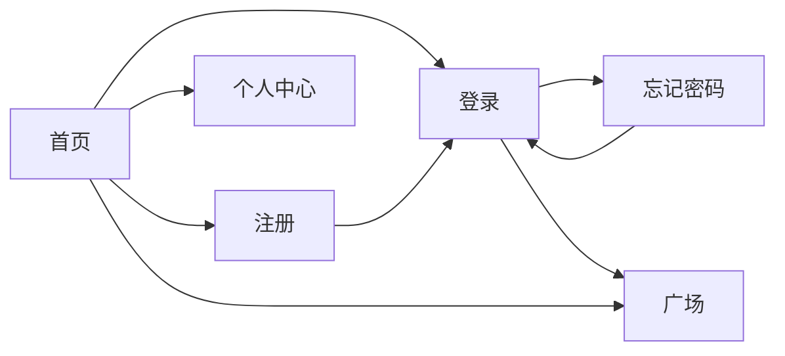
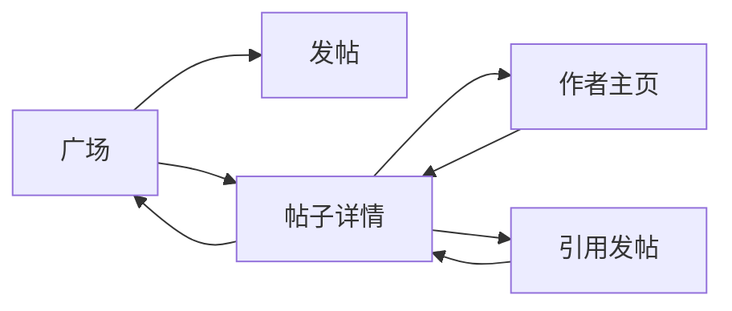
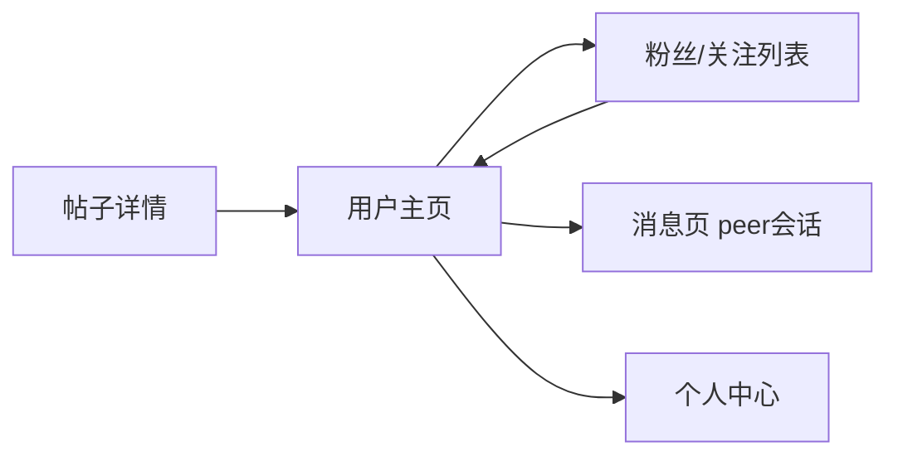
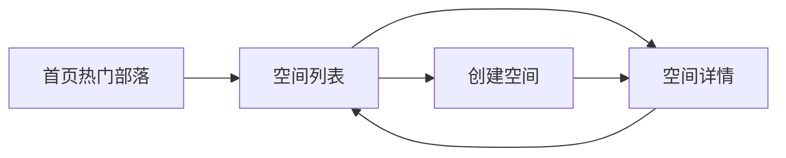
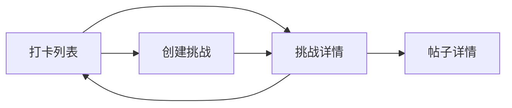
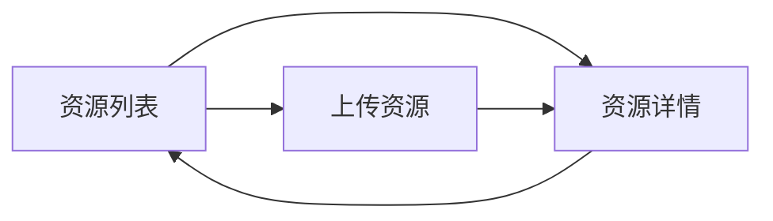
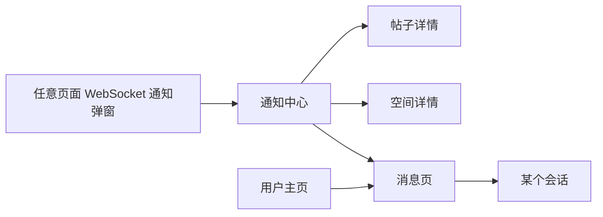
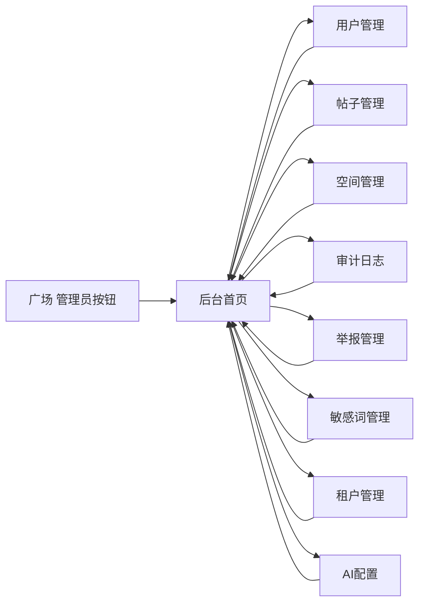
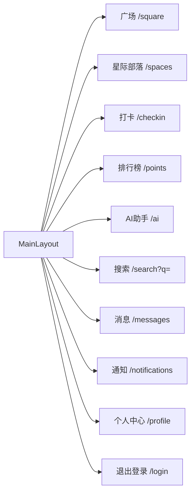
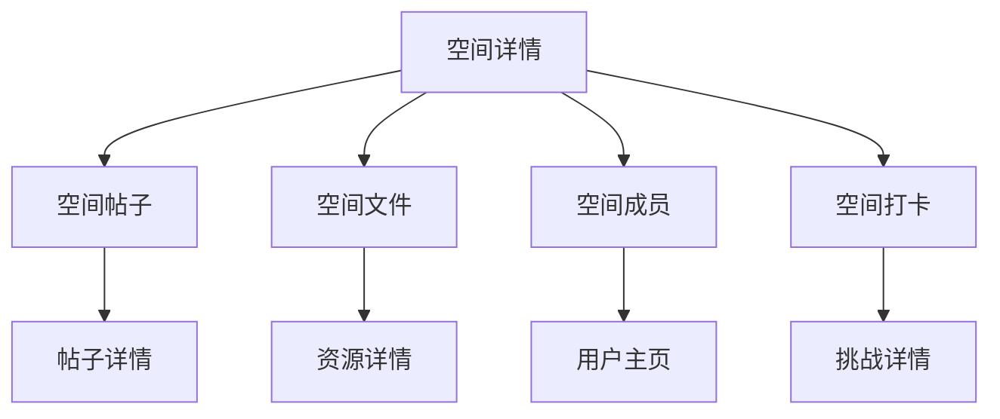

# CampusForum 前端页面跳转关系图

## 1. 文档说明

本文从“用户在页面之间如何流动”的角度，整理当前前端页面的跳转关系。

内容包括：

- 主页面跳转图
- 按业务域拆分的跳转关系
- 后台跳转关系
- 当前已发现的断点与未闭环跳转

说明：

- 关系图以当前前端代码中的实际 `router.push` / `router.replace` / 路由守卫行为为基础。
- 使用 Mermaid 绘制，后续可直接在支持 Mermaid 的编辑器或文档平台中渲染。

---

## 2. 全局路由流转总览

```mermaid
flowchart TD
    A[首页 /] -->|未登录点击登录| B[/login]
    A -->|未登录点击注册| C[/register]
    A -->|已登录点击进入社区| D[/square]
    A -->|已登录点击个人中心| E[/profile]
    A -->|查看全部热门部落| F[/spaces]

    B -->|登录成功| D
    B -->|忘记密码| G[/forgot-password]
    B -->|去注册| C

    C -->|注册成功| B
    C -->|去登录| B

    G -->|重置成功| B

    D -->|发布帖子| H[/posts/new]
    D -->|打开帖子| I[/posts/:id]
    D -->|管理员入口| J[/admin]

    I -->|点击作者| K[/users/:id]
    I -->|引用帖子| H
    I -->|删除成功| D

    K -->|编辑本人资料| E
    K -->|查看粉丝/关注| L[/users/:id/follows]
    K -->|私信| M[/messages?peer=id]
    K -->|查看最近帖子| I

    E -->|依赖主布局顶部导航| D
    E -->|依赖主布局顶部导航| F
    E -->|依赖主布局顶部导航| N[/checkin]
    E -->|依赖主布局顶部导航| O[/points]
    E -->|依赖主布局顶部导航| P[/ai]

    F -->|创建空间| Q[/spaces/new]
    F -->|查看空间| R[/spaces/:id]

    Q -->|创建成功| R

    N -->|创建挑战| S[/checkin/new]
    N -->|查看挑战| T[/checkin/:id]

    S -->|创建成功| T
    T -->|返回列表| N
    T -->|分享打卡记录| I

    U[/resources] -->|上传资源| V[/resources/upload]
    U -->|查看资源| W[/resources/:id]
    V -->|上传成功| W
    W -->|删除成功| U

    X[/search] -->|结果跳帖子| I
    X -->|结果跳用户| K
    X -->|结果跳资源| W
    X -->|结果跳空间| R

    Y[/notifications] -->|通知跳转| I
    Y -->|通知跳转| R
    Y -->|通知跳转| M

    M -->|切换会话| M

    J -->|用户管理| J1[/admin/users]
    J -->|帖子管理| J2[/admin/posts]
    J -->|空间管理| J3[/admin/spaces]
    J -->|审计日志| J4[/admin/audit-logs]
    J -->|举报管理| J5[/admin/reports]
    J -->|敏感词| J6[/admin/sensitive-words]
    J -->|租户管理| J7[/admin/tenants]
    J -->|AI配置| J8[/admin/ai-config]
```

---

## 3. 路由守卫与访问分流图

```mermaid
flowchart TD
    A[进入任意路由] --> B{是否 requiresAuth?}
    B -- 否 --> C{是否 guest 页面?}
    B -- 是 --> D{本地是否有 token?}

    D -- 否 --> E[/login]
    D -- 是 --> F{是否 requiresAdmin?}

    F -- 否 --> G[允许进入]
    F -- 是 --> H{role 是否 TENANT_ADMIN 或 SUPER_ADMIN?}
    H -- 是 --> G
    H -- 否 --> I[/]

    C -- 否 --> J{是否访问 / 且已登录?}
    C -- 是 --> K{是否已登录?}

    K -- 是 --> L[/square]
    K -- 否 --> G

    J -- 是 --> L
    J -- 否 --> G
```

---

## 4. 按业务域拆分的跳转关系

## 4.1 账号与访客入口



### 说明

- 首页是游客主入口
- 登录是所有受保护页面的统一入口
- 注册与忘记密码都回流到登录

---

## 4.2 广场内容链路



### 说明

- 广场是内容消费起点
- 帖子详情是互动核心节点
- 引用发帖会形成二次创作闭环

---

## 4.3 用户社交链路



### 说明

- 作者曝光是从内容进入社交关系的第一入口
- 用户主页承担关注、私信、再浏览内容三项任务

---

## 4.4 学习空间链路



### 说明

- 首页只提供空间入口导流
- 真正的空间发现页是 `Spaces.vue`
- 空间详情目前视觉稿成分更高

---

## 4.5 打卡挑战链路



### 说明

- 挑战详情不仅是参与页，也是“分享到广场”的桥接页
- 打卡和帖子模块形成跨域联动

---

## 4.6 资源分享链路



### 说明

- 资源业务是标准列表 -> 创建 -> 详情闭环
- 删除后返回列表

---

## 4.7 搜索链路

```mermaid
flowchart TD
    A[顶部全局搜索] --> B[/search?q=关键词]
    C[@提及文本] --> B
    D[搜索页手动输入] --> E[搜索结果]
    E --> F[帖子详情]
    E --> G[用户主页]
    E --> H[资源详情]
    E --> I[空间详情]
```

### 说明

- 搜索是连接多个业务域的统一分发节点
- 但目前存在“跳过去了，没有自动搜”的断点

---

## 4.8 通知与消息链路



### 说明

- 通知负责召回
- 消息负责持续沟通
- 用户主页是发起私信的主要入口

---

## 4.9 后台治理链路



### 说明

- 后台页面之间通过左侧导航切换
- 管理入口在前台广场中对管理员可见

---

## 5. 主布局导航关系

## 5.1 前台主布局导航图



### 说明

- 这是登录后的全局导航骨架
- 绝大多数前台页面都共享这一层导航

---

## 5.2 后台布局导航图

```mermaid
flowchart LR
    A[AdminLayout] --> B[/admin]
    A --> C[/admin/users]
    A --> D[/admin/posts]
    A --> E[/admin/spaces]
    A --> F[/admin/audit-logs]
    A --> G[/admin/reports]
    A --> H[/admin/sensitive-words]
    A --> I[/admin/tenants]
    A --> J[/admin/ai-config]
    A --> K[返回前台 /]
```

---

## 6. 当前已识别的跳转断点

## 6.1 搜索 query 断点

### 现状

- `MainLayout` 搜索框跳 `/search?q=关键词`
- `MentionText` 点击提及跳 `/search?q=@用户名`
- 但 `Search.vue` 没有读取 `route.query.q`

### 结果

- 用户已经被带到搜索页，但搜索框不会自动填充，也不会自动执行搜索

### 影响

- 降低全局搜索与提及搜索的完成度

---

## 6.2 首页到受保护页面的“表面可达、实际受守卫拦截”

### 现状

首页导航中有：

- `/spaces`
- `/square`
- `/checkin`
- `/points`
- `/ai`

但这些页面都要求登录。

### 结果

- 游客点击后会被路由守卫重定向到 `/login`

### 影响

- 从产品角度这是合理的“先登录再进入”策略
- 但若想提升转化率，可以增加“预览页”或更明确的登录引导提示

---

## 6.3 空间详情页存在指向未实现路由的 UI

### 现状

`SpaceDetail.vue` 内部 mock 菜单包含：

- `/discover`
- `/favorites`
- `/settings`

当前路由中并不存在这些页面。

### 结果

- 若用户真正点击，会落到 404

### 影响

- 说明该页仍偏设计稿，尚未完全与现有路由体系对齐

---

## 6.4 个人中心页的内部交互未真正闭环

### 现状

`Profile.vue` 中存在：

- 编辑资料按钮
- 设置按钮
- 动态 / 帖子 / 回复 / 收藏 / 打卡 / 成就 tabs

但当前多数没有真实跳转或数据切换逻辑。

### 结果

- 页面更多是展示，不是实际流程节点

---

## 6.5 AI 助手页菜单未形成真实分流

### 现状

- 智能摘要可用
- 内容检测 / 敏感词检测 / AI 问答只是“敬请期待”

### 结果

- 菜单切换只是界面切换，不构成真实业务跳转或处理闭环

---

## 7. 建议补强的跳转链路

## 7.1 搜索自动执行链路

建议补成：

```mermaid
flowchart LR
    A[顶部搜索或@提及] --> B[/search?q=xxx]
    B --> C[Search.vue 读取 query.q]
    C --> D[自动填充搜索框]
    D --> E[自动执行 search API]
```

---

## 7.2 用户主页到发起私信的完整链路优化

建议补成：

```mermaid
flowchart LR
    A[用户主页 私信] --> B[/messages?peer=id]
    B --> C[自动打开会话]
    C --> D[若无历史消息 显示对方资料头]
    D --> E[开始发送首条消息]
```

---

## 7.3 空间详情与空间内业务闭环

建议未来补成：



---

## 8. 建议作为下一份文档继续补的内容

如果还要继续深化，下一份最有价值的文档建议是：

1. **页面状态流转图**
   - 每个页面的加载态 / 空态 / 错误态 / 无权限态

2. **高频用户旅程图**
   - 新用户注册到首次发帖
   - 浏览帖子到私信作者
   - 打卡后分享到广场
   - 举报后后台处理

---

## 9. 总结

当前前端页面跳转关系已经形成了比较清晰的产品骨架：

- 首页承担流量入口
- 广场承担内容主场
- 帖子详情承担互动枢纽
- 用户主页承担社交关系入口
- 打卡、资源、搜索承担功能型业务域
- 通知与消息承担召回与沟通
- 后台承担治理与配置

其中最重要的主链路可以概括为：

**首页 / 登录 -> 广场 -> 帖子详情 -> 用户主页 -> 私信 / 关注**

以及：

**打卡详情 -> 分享到广场 -> 帖子详情**

再加上：

**通知中心 -> 业务详情页回流**

这三条链路共同构成了当前产品的主交互骨架。
